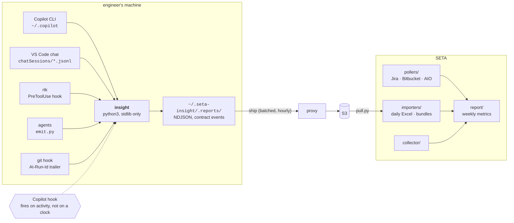

# Architecture

Two sides that never talk to each other directly.



The engineer's machine holds what the central side cannot see, and the reverse.
Neither is sufficient alone.

---

## Why the client has to exist at all

Three signals are **only** visible locally, and no amount of API polling recovers them:

| Signal | Why it is local-only |
|---|---|
| Copilot tokens, premium requests, agent name, tool and gate outcomes | Copilot CLI writes its session journal to `~/.copilot` on the developer's machine and sends it nowhere |
| Which agent ran, which phase, which task | `emit.py` writes to a local NDJSON buffer |
| `AI-Run-Id` at commit time | the trailer is written before the push |

`FINDINGS.md §2` measured all three as **zero**. That is the entire reason the current
report measures engineering output and calls it AI effectiveness.

---

## Distribution — a stdlib-only zipapp, or a checkout

**Target: SETA internal only, macOS and Ubuntu.** No Windows path is designed, built
or tested; if that changes it is new work, not a flag.

```bash
curl -fsSL https://aeris-insight.seta-international.com/install | sh
insight setup
```

The artifact is a single `insight.pyz` — a Python zipapp built from `cli/`,
`pollers/common.py` and `collector/main.py`, published to GitHub Releases on the
public `seta-canhta/usage-insight` repo and verified against a SHA-256 embedded in
the install script. No package manager, no registry, no `npx`, no `pipx`, no `uv`,
and still nothing to resolve on someone else's machine.

`docs/SETUP.md` carries the two-step verified form for anyone who would rather not
pipe a script into `sh`, and the reasoning for why the installer stops without
running `setup`.

**The CLI must behave identically from a checkout and from the zipapp.** A clone
runs `./insight`; an install runs `insight`; both execute the same modules. That is
a constraint on the code, not a coincidence — anything that reads a path relative to
the repository root, or expects a `.git` directory, or ships a file that the zipapp
build does not include, produces a tool that works for its authors and fails for
everyone else. Test both.

```bash
git clone git@github.com:seta-canhta/usage-insight.git
cd usage-insight && ./insight pack
```

### Why Python and not Node or Go

The deciding question is not which runtime is installed. It is **how many times the
contract gets implemented.**

The client's job overlaps `emit.py` almost exactly: build the envelope, derive a
deterministic `event_id`, check the attribute allow-list, append to an NDJSON buffer.
That already exists, tested, in Python — roughly 3,200 lines across `emit.py`,
`pollers/common.py` and `collector/main.py`.

Choosing Node or Go means writing a second implementation of the same contract in
another language. The piece most likely to drift is also the safety-critical one: the
**allow-list check** is the only thing standing between a machine full of prompts,
source code and secrets and a file that gets handed to management. Two implementations
of that check, in two languages, is precisely where a leak comes from.

Two editable copies of `CONTRACT.md` would drift. Two
implementations of it drift for the same reason.

| | Python | Node | Go |
|---|:--:|:--:|:--:|
| Reuses the existing contract code | **yes** | no | no |
| One implementation of the allow-list | **yes** | no | no |
| Runtime present on macOS + Ubuntu | yes | via nvm, per-user | n/a — static binary |
| Build matrix | none | none | darwin-arm64/x64, linux-x64 |
| Languages in the system | **1** | 2 | 3 |

Go's real advantage — a static binary needing no runtime — only pays when the runtime
is missing. `python3` ships with Ubuntu and arrives on macOS with the Xcode command
line tools, which every engineer already has because git needs them.

### The constraint that keeps this simple

**Standard library only. No third-party dependencies.** No virtualenv, no
`pip install`, no dependency resolution on someone else's machine, nothing to break
when a transitive package changes. Target Python 3.9 so the macOS system interpreter
works unmodified.

The existing pipeline already follows this rule — `pollers/common.py` hand-writes its
own `.env` reader rather than take a dependency. Keep it.

### A side effect worth keeping

The zipapp is a zip file of readable Python, and the repository it is built from is
public, so an engineer can read exactly what is collected and why — with `unzip`, or
by cloning. A tool that measures you should be one you can read. That supports the
consent model the rest of this document depends on, and it costs nothing.

Keeping `git clone` + `./insight` working is part of the same argument, not legacy
support: it is how anyone develops on this, and it is the version whose provenance
needs no checksum to trust.

The central pipeline is the same language and the same code. There is no client/server
translation layer to keep in sync — only the parts of the repo each side runs.

---

## What the client does

```
insight setup        # the wizard: consent, email, hourly schedule, commit hook
insight copilot      # read ~/.copilot's session journals
insight pack         # read the three local sources, write the weekly bundle
insight ship         # upload the sealed bundle -- server/README.md
insight whoami       # the allow-list line to send to whoever runs the server
insight status       # what is buffered, what was last packed, what was sent
insight purge        # delete everything collected
```

**There is no daemon, and now there is nothing to switch on either.** Copilot CLI
keeps a per-session journal at `~/.copilot/session-state/<session-id>/events.jsonl`
and writes it whether or not anything is watching. No exporter, no setting, no
listening port, no background process, no lifecycle to manage, no "is it running?"
support burden. `pack` reads three local sources and writes one file:

```
pack
 ├── ~/.copilot/session-state/*/events.jsonl  (Copilot's own session journal)
 ├── ~/.aiep/telemetry/*.ndjson               (the agent emitter's buffer)
 └── git log                                  (markers and AI-Run-Id trailers)
```

Run it once a week, then `ship`. They stay two commands because the consent model
rests on the engineer reading their own bundle before deciding to send it, and an
upload folded into `pack` would remove that without saying so.

`purge` exists because a person who cannot delete their own telemetry has not
consented to it. The journal helps here too: the engineer can read exactly what
Copilot recorded before deciding to hand it over.

`purge` is local, and says so when it runs: it cannot reach a bundle already
uploaded. Implying otherwise would be a worse failure of the consent model than
not offering the command at all.

**`insight copilot` never deletes the journal.** The command it replaced truncated
Copilot's span file after every read, and that was correct: the file existed only
because we asked for it and it held prompts. This one is Copilot's own history of
the user's work — it is what `/resume` reads — and it is not ours to clear.
Re-reading is safe instead: every `event_id` is derived from the journal record's
own uuid, so a session left open for a week is read hourly and buffered once.

### The design that replaced a redacting collector

The span exporter needed a mitigation we had to build and run. It leaked prompt
content regardless of `captureContent: false` — microsoft/vscode#326254, open, see
`FINDINGS.md §3.4` — so anything downstream of it needed a redacting collector in
between, and `cli/otel_read.py` kept 22 named fields on the way past.

The journal removes the transport half of that problem and sharpens the other half.
It never leaves the machine on its own, so there is no leak to stand in front of;
but it is a **larger** concentration of content in one place than the span file ever
was — the whole conversation sits next to the numbers: `user.message.content`,
`assistant.message.content`, `arguments.file_text`, `old_str`/`new_str`,
`result.content` holding real command output and file contents, `reasoningText`, and
absolute paths carrying the username.

So `cli/copilot_read.py` is built on an **allow-list, not an exclusion list**:

* It names the fields it keeps, by dotted path, per event type. Everything else is
  dropped without inspection. An exclusion list is only as good as today's knowledge
  of a file format that gains keys without asking.
* Nested values are refused outright — a `dict` or `list` leaf returns nothing even
  when its path is on the keep-list, because free text hides in structure.
* Three fields are read to classify and then discarded, the same rule the
  commit-subject parser follows: the shell command (which gate is this?), the tool
  error message (which failure class?), and the anchored tail of a command's output
  (which exit code?). None of the three is stored.
* `file_path` is made **repo-relative**. Journal paths are absolute and begin
  `/Users/<name>/`. A path sitting under no known `gitRoot` or `cwd` is dropped, not
  truncated — a half-path is not worth a guess about which prefix was safe to remove.
* `verify_no_content()` re-checks every event against `collector/main.py`'s own
  allow-list before anything is written, and refuses the whole read if one attribute
  is outside it. The keep-list should make that impossible; it runs anyway, because
  the cost of being wrong is publishing somebody's prompts.

Measured 2026-08-26 across 22 real journals: 2,935 contract events, **zero absolute
paths and zero usernames** in the output, verified by sweep.

`insight setup` also **removes** the `github.copilot.chat.otel.*` settings from any
machine that still carries them. A retired exporter left switched on goes on writing
prompts to a file nobody reads any more, which is strictly worse than the situation
it was configured for.

### What it covers, and what it does not

The journal covers the **Copilot CLI / agent surface only**. VS Code's Copilot Chat
panel and inline completions write nothing to `~/.copilot` and are unmeasured. Pilot
usage is mixed across the three.

That is a scope decision, not an oversight, and it is stated in the data rather than
only in prose: `coverage()` publishes `surfaces_not_covered` on every read, together
with the count of sessions whose usage is unknowable, and `insight copilot` carries
the block into its output every time — not only when it looks bad. **A surface nobody
measured must never read as a surface nobody used.**

### What it must never capture

`CONTRACT.md §1.1`, restated because the client is where the temptation lives: no
prompts, no responses, no source code, no diffs, no secrets, no error message bodies,
no raw email addresses. Counts, hashes, bounded enums, and file paths only.

The client runs on a machine full of exactly the things it is forbidden to collect.
Every field it writes must be checked against the attribute allow-list before it lands
in the buffer — not on ingest at the far end, where it is already too late.

---

## Where the data lives

```
~/.seta-insight/
  config.json          machine id, consent, salt, work email, upload secret (0600)
  buffer/*.ndjson      append-only, one file per day
  .reports/            packed bundles, kept after upload so they stay readable
  shipped.json         receipts: which bundle went where, and when
```

**Home directory, not the project.** A `.reports/` folder inside a working repo gets
committed by accident, ends up in a PR diff, and reaches a system nobody intended.

Each bundle carries a **manifest**: machine id, collector version, the window covered,
event counts by type, and a checksum.

---

## Collection is voluntary and per-week, which has consequences either way

`ship` replaced the person attaching a file, but none of the following changed --
they are consequences of *voluntary, per-week* collection, not of how the file
travels. They were designed for before there was a transport, which is why
adding one changed nothing below this line.

| Risk | Handling |
|---|---|
| The same week handed over twice | deterministic `event_id` — already required by `CONTRACT.md §1.3` |
| A week never handed over | the manifest declares its window; a missing window renders as **"no data"**, never as zero |
| Someone was on leave | a bundle with zero events is a *measured* zero and looks different from an absent bundle |
| Clock skew between machines | client stamps `event_time` in UTC; the collector stamps `ingested_at` on receipt; never sort by one alone |
| Bundle edited before handover | out of scope to prevent — see below |
| Bundle altered in transit | `X-Insight-Digest` over the whole file, recomputed by the proxy; the manifest's own checksum is re-verified again at import |

**On tamper-evidence:** the engineer can read and edit their bundle before sending it.
That is not a flaw to engineer away — it is what makes the collection consensual, and
it is the reason `purge` exists. But it does mean the data is **not** an audit trail
and must never be used as one. Report it as what it is: a voluntary record. Anyone who
wants to use these numbers for individual performance assessment should be told the
data does not support it, before they try.

**The "absent is not zero" rule matters most here.** With API polling, a gap is a bug.
With voluntary bundles, a gap is the normal case — someone forgets, someone is on
leave, someone joins mid-quarter. A report that renders those as `0` will show a team
getting worse when it is only getting quieter. Every aggregate carries how many machine
weeks it actually covers.

**Automation made this worse, and had to be paid for.** A bundle that never
arrived by email was visible: no email came. A bundle that never arrived over
HTTP is silence, and silence reads as zero unless something insists otherwise.
That is why `importers/pull.py` takes a roster of work emails and names who did
not report — coverage derived from bundles that *did* arrive cannot see someone
who has never sent one.

---

## Transport — built, and it changed nothing else

The prediction above held. `pack` already produced a sealed, manifested bundle, so
shipping became one `PUT` and nothing about the local design moved. The bundle
format, the allow-list, the import path and the coverage accounting are all
untouched — `importers/bundle.py` verifies a checksum written on another machine a
week earlier exactly as it did when the file arrived by email.

The full wire contract is **[`server/README.md`](../server/README.md)**. In brief:

- The laptop `PUT`s to a small proxy that owns the S3 credentials. No SigV4 on a
  machine full of source code, no SDK, no OAuth — the stdlib-only rule survives.
- The **proxy chooses the object key** from the authenticated identity, so one
  laptop can neither overwrite another's bundle nor list the team's.
- Identity is a work email plus a secret minted on the laptop; the server's
  `.env` holds only `sha256(secret)`. A leaked whitelist uploads nothing.
- The email is transport only. `CONTRACT.md §1.1` forbids raw addresses in
  collected data and nothing writes one into a bundle.
- `409` on a duplicate, because the key is the content digest and writes use
  `IfNoneMatch`. Idempotency is a property of the storage, not code that can rot.

Keeping the bundle format self-describing turned out to be the load-bearing
decision: the transport carries an opaque blob and needs to understand none of it.
