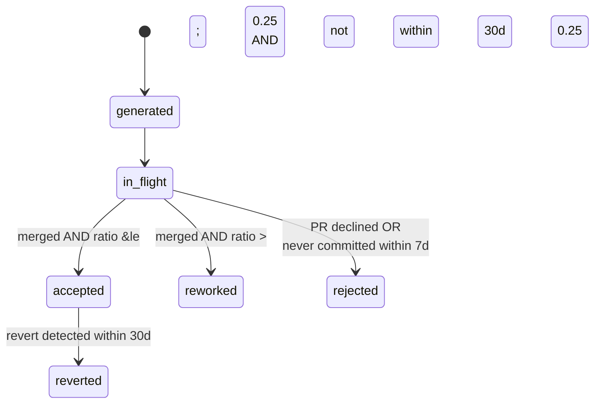

# AI Telemetry — Schema Contract v1.1.0

**This file is the single source of truth.** Every component (emitter, collector,
pollers, warehouse, metric SQL) MUST conform to it. Do not redefine these structures
locally. If a change is needed, change it here and bump `schema_version`.

---

## 1. Non-negotiable rules

1. **Never store content.** No prompts, no responses, no source code, no diffs, no
   secrets, no error message bodies, no raw email addresses. Store hashes, counts,
   bounded enums, and file paths only.
2. **Fail open.** Telemetry must never block, slow, or fail an agent run. Every
   client-side error is swallowed and logged locally.
3. **Idempotent.** `event_id` is the dedup key. Re-delivery must be safe.
4. **Append-only.** Never update or delete a raw event. Corrections are new events.
5. **Bounded dimensions.** Any field used as a metric dimension must have < 100
   distinct values. High-cardinality ids live in the payload, not in metric labels.
   (enforced by DQ-15)
6. **No ROI, no counterfactual.** There is no non-AI control group. Do not compute `time_saved` as a headline, and do not emit any
   monetary "value delivered" field. The economic metric is cost per accepted output.

---

## 2. Envelope

Every event is one JSON object with exactly these top-level keys.

```jsonc
{
  "schema_version": "1.0.0",          // string, semver, required
  "event_id":       "evt_<uuid4hex>", // string, required, dedup key. Live-emitted
                                      //   events use uuid4. BACKFILL events from
                                      //   pollers MUST instead use a deterministic
                                      //   sha256 of the fact's natural key, so that
                                      //   re-polling a window is idempotent (rule §1.3)
                                      //   and a watermark rewind cannot duplicate rows.
  "event_type":     "run.completed",  // enum, required, see §3
  "event_time":     "RFC3339 UTC",    // required, when it happened on the client
  "ingested_at":    "RFC3339 UTC",    // set by the collector, never by the client

  "trace_id":       "trc_<uuid4hex>", // required — one user-initiated workflow
  "run_id":         "run_<uuid4hex>", // required KEY, nullable VALUE — one agent
                                      //   invocation. Null means "no run owns
                                      //   this": a poller observation (§2.4), or
                                      //   session-grain usage covering several
                                      //   runs. Absent is a malformed event and
                                      //   is rejected — reading a forgotten field
                                      //   as "no run" turns a client bug into a
                                      //   silently unattributed row
  "parent_run_id":  null,             // string|null — sub-agent -> supervisor
  "span_id":        "spn_<uuid4hex>", // string|null — one phase

  "actor":   { ... },                 // §2.1, required
  "context": { ... },                 // §2.2, required
  "agent":   { ... },                 // §2.3, required
  "attributes": { ... },              // §3, event-type specific
  "link":    { "method": "explicit", "confidence": 1.0 }  // §2.4, required
}
```

### 2.1 `actor`

| Field | Type | Req | Notes |
|---|---|---|---|
| `person_id` | string\|null | ✓ | Atlassian `accountId`. **Canonical person key.** |
| `person_email_hash` | string | ✓ | `sha256(salt + lower(git_author_email))`, hex. **Never the raw email.** |
| `team_id` | string\|null | ✓ | From directory; null until OQ-6 resolves |
| `role` | enum\|null | ✓ | `dev` `qa` `devops` `po` `lead` |

### 2.2 `context`

| Field | Type | Req | Notes |
|---|---|---|---|
| `jira_issue_key` | string\|null | ✓ | `^[A-Z][A-Z0-9]+-\d+$` |
| `jira_project_key` | string\|null | ✓ | Derived from the key |
| `repo_full_name` | string\|null | ✓ | `{workspace}/{repo_slug}` |
| `branch_name` | string\|null | ✓ | |
| `product_profile` | string\|null | ✓ | `watchtower` `automotive` … |
| `environment` | enum\|null | ✓ | `dev` `sit` `pre` `prd` `local` |
| `test_case_key` | string\|null | ✓ | AIO TCMS case, e.g. `IML-TC-5`. **Added 2026-08-27** |
| `test_cycle_key` | string\|null | ✓ | AIO TCMS cycle, e.g. `IML-CY-199`. **Added 2026-08-27** |

**On the two AIO fields.** They are context, not attributes, because they say
what an event is *about* — the same job `jira_issue_key` does — and because
`attributes` is per-event-type while this question is asked of every event
alike. For a QA team this is the more important key space of the two: the test
cycle is the delivery record and the pull request is not (§3 row 22).

Nothing could read them before 2026-08-27. `JIRA_KEY_RE` is
`\b([A-Z][A-Z0-9]+-\d+)\b`, which needs digits straight after one dash, so
`IML-TC-5` did not match — and its *tail* did, offering the false ticket
`TC-5`. That is two of the four fabrications recorded against
`extract_jira_key`: `TC-12018` and `CY-199`. AIO keys are now masked before the
Jira scan, so an unconfigured reader cannot mint one either. The allow-list
applies to the project prefix here by the same rule: `NOPE-TC-5` yields
nothing. AR-1 does not care which vocabulary is being fabricated.

**How they get filled on the chat surface — added 0.9.0.** Three routes, and
`link.confidence` says which one answered: **0.9** the branch, **0.7** the path
of a file a tool call opened or edited, **0.5** a key named in the prompt. Each
fills only what the one above it left empty, so a weaker signal can turn a NULL
into a key and can never move a key that already existed.

The path route is the only one that needs nobody to type anything, and it is
the same route `test_case_keys` takes on the Bitbucket side (§3 rows 17–18) —
there from the file names a pull request changed, here from the file the
assistant actually touched. **Measured 2026-08-27** on the August pull of
`aeriscom/wt-playwrite-taf`: the repository does name spec files after cases —
41 distinct `IML-TC-*` keys — but only **2 of 36** merged pull requests carried
one. It is a thin signal and must be reported as one; it does not make
case-level attribution work.

**Only the AIO keys are read from a path, never `jira_issue_key`.** A directory
component is exactly the shape that minted `AUG-25` from `fix/AUG-25`. The AIO
prefixes are narrower and the allow-list still applies. AR-1.

**The path is read and dropped.** `cli/vscode_read.py` names the argument keys
it looks at (`filePath`, `path`, `uri`) rather than the `arguments` object,
because `content` — the file the model just wrote — sits in that same object.
Naming keys is a projection; reading `arguments` would be a blanket, and a
blanket over a dict that contains the source is how content ships.

**No schema bump.** `collector/main.py:_subset` builds the context block from
its own declared field list, so a client that predates these fields yields
NULLs and one that carries them is read. An older client stays valid — which is
what lets a fleet upgrade over a working day rather than all at once.

### 2.3 `agent`

| Field | Type | Req | Notes |
|---|---|---|---|
| `agent_name` | string | ✓ | From `.agent.md` frontmatter `name` |
| `agent_version` | string\|null | ✓ | Git SHA (short) of the `.agent.md` at load time |
| `skill_name` | string\|null | | |
| `skill_version` | string\|null | | Git SHA of the `SKILL.md` |
| `surface` | enum | ✓ | `vscode-copilot-chat` `copilot-cli` `headless` `unknown` |

### 2.4 `link`

| Field | Type | Req | Notes |
|---|---|---|---|
| `method` | enum | ✓ | `explicit` \| `heuristic` \| `marker_only` |
| `confidence` | float | ✓ | 0.0–1.0. `explicit` ⇒ 1.0 |

**Rule:** only `method='explicit'` rows may be used for cost-per-output metrics.

**On `confidence`, for `heuristic` rows from the chat surface.** The value is
not a mood: each key-resolution route sets exactly one, and nothing else
writes them — 0.9 branch, 0.7 tool-call path, 0.5 prompt mention (§2.2). That
makes the field readable as *which route answered*, which is what
`vscode_read.key_capture` counts and publishes on every run. An event at 0.9
carrying no key at all means the branch was consulted and had nothing, which
is a different fact from a route not having been tried.

**Poller events carry `run_id = null` unless the commit carries an `AI-Run-Id` trailer.**
Never synthesise a `run_id` to force a join — that manufactures a join key and breaches
AR-1. The trailer is the only thing that earns `method='explicit'` on a backfilled row;
everything else is `heuristic` or `marker_only`.

---

## 3. Event types and their `attributes`

`event_type` is a closed enum. Unknown values are rejected by the collector.

| # | `event_type` | Source | `attributes` |
|---|---|---|---|
| 1 | `run.started` | emitter | `invocation_mode` (`jira_driven`\|`direct_plan`\|`unknown`), `model_declared_id`, `input_source` |
| 2 | `run.bound` | emitter **and `insight copilot`** | **`copilot_session_id`** (= the `~/.copilot/session-state/<id>` directory name), `jira_issue_key`, **`base_commit_sha`**, **`head_commit_sha`**, `repository_host`. ⭐ The bridge between the usage stream and the correlation stream — **but see the warning below: it is NOT a join key on its own**. **Renamed in 1.1.0** from `otel_conversation_id`, which the collector still accepts: an exact-match rename would reject a whole week from any client that had not upgraded. **The commit range was added in 1.1.0** and is what makes this row evidence rather than an assertion: a session id joins to a ticket only *through* something, and measured 2026-08-26 the branch name is not that something — **0 of 37** real branches carried a Jira key, so deriving one from the branch resolves to NULL on every real session. A SHA does not have that problem. One row **per branch** the session moved: a session that starts on `main` and resumes on a feature branch has two ranges, and spanning them would charge it for every commit in the gap. `jira_issue_key` stays NULL here — resolving a range to a ticket is the warehouse's job, where the SCM side of the join lives. **Captured live, never reconstructed:** of the seven `gitRoot`s these journals name, one still existed when anything went looking; worktrees are deleted when their branch merges, which is precisely the sessions that produced something |
| 3 | `run.phase.started` | emitter | `phase_name` |
| 4 | `run.phase.completed` | emitter | `phase_name`, `duration_ms`, `status` (`ok`\|`failed`\|`skipped`) |
| 5 | `model.call` | **journal** | `model_id`, `input_tokens`, `output_tokens`, `cached_input_tokens`, `cache_write_tokens`, `reasoning_tokens`, `latency_ms`, `retry_count`, `finish_reason`, `request_count`, `premium_requests`, `nano_aiu`, `tool_definitions_tokens`, `system_tokens`, `conversation_tokens`. **Source changed in 1.1.0** from Copilot's OTel span stream to its own session journal; the wire names below are that journal's. **Wire names, measured 2026-08-26:** `session.shutdown.modelMetrics.<model>.usage.{inputTokens, outputTokens, cacheReadTokens, cacheWriteTokens, reasoningTokens}`, `.requests.count` (→ `request_count`), `.requests.cost` (→ `premium_requests`), `.totalNanoAiu`. **`premium_requests` is the billing unit** — Copilot charges per seat plus premium requests, never per token, so a token figure is an economic weight and this is the invoice line. One event covers every call to one model in one session: the journal totals usage per session, so `latency_ms` is carried only where a session used a single model (`totalApiDurationMs` is the session's, and dividing it by `request_count` would be modelling). `retry_count` and `finish_reason` are **not recorded by this source** and stay NULL — never 0. The three `*_tokens` context fields are a **level, not a total**: what the model was carrying at the end of the session and paid for on every request in it, from `session.shutdown.{toolDefinitionsTokens, systemTokens, conversationTokens}`. `tool_definitions_tokens` measured 14,318–34,219 across only 7 distinct values in 57 sessions — a step function, and it steps when an MCP server is connected, making it the only measure in this contract that prices that decision. Its share of context is **17.1–73.8%, median 34.2%**, and the three fields sum to `session.shutdown.currentTokens` within 4 tokens on all 57, so they are the whole context rather than a subset. Multiplying any of the three by `request_count` would be modelling, not measurement |
| 6 | `tool.call` | **journal** | `tool_name`, `tool_kind` (`mcp`\|`terminal`\|`file`\|`http`\|`other`), `duration_ms`, `status`, `error_class`. **Source changed in 1.1.0.** `status` was structurally NULL under the span source — spans carried no status field — so the weekly report's tool-failure count was always 0 by construction, not by measurement. `tool.execution_complete.success` now supplies a real verdict and `error.code`/`.message` a bounded `error_class`; the message itself is read to classify and discarded. `duration_ms` stays NULL: the journal timestamps the two ends of a call, and the gap includes waiting for a human to approve it, which is not the tool's duration |
| 7 | `human.turn` | emitter | `turn_index`, `turn_kind` (`clarification`\|`correction`\|`approval`\|`rejection`), `chars` |
| 8 | `output.generated` | emitter, git hook, **journal** | `output_id`, `artifact_type` (`code`\|`test`\|`spec`\|`mock`\|`doc`\|`csv`\|`config`), `file_path`, `lines_added`, `lines_removed`, `output_content_hash`, `reuse_source`, `acceptance_state`. **`acceptance_state` added in 1.1.0** — `weekly_report.py` has grouped outputs by it since it was written and this list never permitted it, so ingest stripped every one and the acceptance section rendered empty for reasons that had nothing to do with the emitter. The journal supplies these per edit (`toolTelemetry.metrics.linesAdded`/`linesRemoved`), which is the first source that attributes a written file to the agent that wrote it rather than to the commit that carried it. `file_path` is **repo-relative**: journal paths are absolute and begin with somebody's home directory, and rule 1 keeps raw identifiers out of the stream |
| 9 | `gate.evaluated` | emitter, **journal** | `gate_name` (`build`\|`test`\|`lint`\|`secrets`\|`coverage`), `status` (`pass`\|`fail`\|`skipped`), `quality_score`, `coverage_pct`, `attempt_index`. A shell command that runs a test, lint or build **is** a gate evaluation whether or not an agent emitted one, so the journal synthesises these from the command — read to classify, then discarded. **`status` is a real verdict as of 1.1.0:** Copilot's bash tool appends `<exited with exit code N>` to the output it returns, matched anchored at the end so a command that merely prints the phrase cannot forge a result, and only the integer is taken. Absent on ~12% of calls (still running, or output truncated), and absent means NULL — a missing verdict and a passing one are different facts. `success` on the tool call is **not** the verdict: a failing test suite is a successful bash call, and reading it that way would report every red build green |
| 10 | `run.completed` | emitter | `duration_ms`, `phases_completed` |
| 11 | `run.failed` | emitter | `duration_ms`, `failure_class`, `dependency_failed` (`vpn`\|`network`\|`jira`\|`bitbucket`\|`mcp`\|`aio`\|`ci`\|`none`) |
| 12 | `run.timeout` | emitter | `duration_ms`, `timeout_policy` |
| 13 | `run.abandoned` | **DQ job** | `last_seen_at` |
| 14 | `scm.commit` | git hook | `commit_sha`, `output_ids`, `lines_added`, `lines_removed`, `has_ai_marker` |
| 15 | `scm.pr.created` | emitter | `pr_id`, `commit_shas`, `pr_title_has_ai_marker` |
| 16 | `scm.pr.reviewed` | **poller** | `pr_id`, `reviewer_person_id`, `action` (`approved`\|`changes_requested`\|`commented`), `comment_count`, `reviewed_at`, `is_first_review`, `first_review_at`, `pr_created_on`, `review_lead_time_ms`, `pr_title_has_ai_marker`, `has_ai_marker`. **Corrected 2026-08-27:** this row named five attributes and the poller emitted eleven. Metric 3 is a question about the *first* review and cannot be asked of a row that does not say which one that was |
| 17 | `scm.pr.merged` | **poller** | `merged_at`, `merge_commit_sha`, `merge_lead_time_ms`, `review_to_merge_ms`, plus the **terminal-PR block** below |
| 18 | `scm.pr.declined` | **poller** | `declined_at`, `decline_reason_class`, `decline_lead_time_ms`, plus the **terminal-PR block** below |
| 19 | `scm.revert` | **poller** | `reverted_commit_sha`, `revert_commit_sha`, `days_to_revert`, `resolution`, `reverted_commit_has_ai_marker`, `reverted_at`, `reverted_commit_at`. `resolution` says whether the reverted commit was found at all — a revert of something outside the window is not evidence about that something, and without this the two are one number |
| 20 | `ci.pipeline.completed` | **poller** | `pipeline_id`, `commit_sha`, `status`, `duration_ms`, `tests_total`, `tests_passed`, `tests_failed`, `coverage_pct`, `ci_provider`, `ci_kind` (`build`\|`deploy`), `job_name`, `job_branch`, `build_number`. The **Bitbucket Pipelines** path of the same poller emits a different vocabulary for the same event — `ci_system`, `ci_system_verified`, `coverage_source`, `pipeline_build_number`, `trigger_kind`, `ref_name`, `started_at`, `completed_at`, `step_count`, `failed_step_name`, `tests_skipped` — and both are permitted, because both are emitted. `tests_skipped` belongs beside the other three counts or the four do not sum to `tests_total`, and metric 8 is a rate over that total. **Measured 2026-08-19:** CI is self-hosted **Jenkins**, not Bitbucket Pipelines. The source is `/commit/{sha}/statuses`, which needs no Jenkins credential. `tests_*` and `coverage_pct` are NOT available on that path and stay NULL — never 0 |
| 21 | `jira.transition` | **poller** | `from_status`, `to_status`, `transitioned_at`, `status_category`, `issue` (snapshot sub-object: status, assignee accountId, issue type, labels, parent, estimates), `attribution` (AR-3 evidence sub-object: `rule`, `ai_labels`, `has_ai_labels`, `label_authored_by_ai`, `label_planned_by_ai`, `label_generated_by_ai`, `label_reviewed_by_ai`, `unrecognised_ai_labels`, `has_ai_label_drift`, `is_delivery_ticket_candidate`, `delivery_ticket_key`, `feature_ticket_key`, `feature_ticket_source`, `resolution_confidence`, `linked_issues`, `parent_key`). Issue creation is synthesised as a transition so every issue yields ≥1 event — the enum is closed, so there is no separate snapshot event. **`unrecognised_ai_labels` is a DQ signal, never a count:** it carries label *names* outside the §3.1 closed set, and those tickets are deliberately excluded from every AI figure |
| 22 | `test.run.completed` | **poller** | `test_case_key`, `test_cycle_key`, `test_run_id`, `status` (AIO run status name), `status_category` (`passed`\|`failed`\|`blocked`\|`skipped`\|`in_progress`\|`not_run`\|`other`), `is_automated`, `executed_by_person_id`, `assigned_to_person_id`, `executed_at`, `effort_seconds`, `defect_count`, `folder_name`, `priority`. **Added 2026-08-20**, when an AioAuth key first made AIO TCMS reachable — the enum stopped at 21 because this source was blocked (`401 Invalid or missing API Token`), not because test execution did not matter. For a QA engineer the test cycle *is* the delivery record; pull requests are not. `test_case_title` is deliberately **not** carried: titles are free text, which rule 1 excludes. A run that has never been executed emits `status_category = not_run` with a NULL `executed_at` — it is **not** a failure and must never be counted as one |
| 23 | `test.case.snapshot` | **poller** | `test_case_key`, `automation_status` (AIO's own value, e.g. `Automated` / `To Be Automated`, or NULL when nobody has set it), `automation_owner_person_id`, `has_automation_key`, `test_case_status`, `script_type`, `folder_name`, `priority`, `is_archived`, `created_at`, `updated_at`. **Added 2026-08-20.** This is the *inventory* event, and it exists because the denominator of Automation Coverage is invisible to event 22: a test case nobody has ever executed emits no run, and those are exactly the un-automated cases the coverage metric has to count. `automation_status` is passed through verbatim and is **NULL for roughly half the estate** — an unset field is not "not automated", so a coverage figure must state its known-status denominator or it is measuring how diligently the field is filled in |

#### The terminal-PR block (rows 17 and 18)

Both terminal PR events carry the same summary of the pull request they end.
Written once here because it is written once in `pollers/poll_bitbucket.py`,
and because the two copies that were not written down drifted 34 names apart
from this file between 2026-08-19 and 2026-08-27.

`pr_id`, `pr_state`, `pr_title_has_ai_marker`, `has_ai_marker`, `created_on`,
`first_review_at`, `review_lead_time_ms`, `reviewer_count`, `approval_count`,
`changes_requested_count`, `commits_after_first_review`, `reopened_at`,
`reopen_count`, `revision_count`, `revisions_after_first_review`,
`lines_changed_pre_review`, `lines_changed_after_first_review`,
`self_comment_count`, `bot_comment_count`, `comment_count`,
`inline_comment_count`, `toplevel_comment_count`, `lines_added`,
`lines_removed`, `files_changed`, `files_added`, `files_modified`,
`files_removed`, `automation_scripts_added`, `automation_scripts_modified`,
`automation_scripts_removed`, `automation_files_by_kind`, `commit_count`,
`ai_commit_count`, `ai_run_ids`, `ai_model_ids`, `test_case_keys`.

`test_case_keys` is a **list**, because a pull request touching twenty spec
files is about twenty cases and picking one would be a choice nobody made. It
is read from the *file names* of the changed scripts and is the only route from
a repository to an AIO case that does not depend on somebody typing a key —
measured 2026-08-26, the other three are empty: 0 of 82 branch names carry one,
1 real prompt in 5,036 names any ticket, and `has_automation_key` is false on
all 4,512 cases including the 4,165 marked "Automated". Only the key survives;
`classify_path` already reads and drops these paths under §11.3 and that is
unchanged.

Every name is a count, a timestamp, a duration, a classification or an id. No
path, no title, no message body, no valuation. `automation_files_by_kind` maps
a classified kind to counts; the paths that produced it are classified and
dropped in the poller (rule 1, §11.3).

**`lines_changed_after_first_review` is §5's numerator and was emitted by
nothing until 2026-08-27.** `sql/08_metrics.sql` has summed it since it was
written, over a column no poller filled, so `v_rework_rate` reported a rework
rate over no rework — indistinguishable downstream from a team that never
reworks anything. It is now measured per commit, against each commit's first
parent, split at `first_review_at`. `lines_changed_pre_review` is the other
side of that split and §8.9 requires it reported *beside* rework rather than
folded into it.

**Both are NULL when the PR was never reviewed** — not 0. Without a first
review the boundary that defines "before" and "after" does not exist, and a
zero would read as "nothing was reworked": the wrong answer rather than the
missing one (§1). A failed per-commit request nulls both rather than returning
a smaller number, because an undercount of rework is wrong in the flattering
direction and nothing downstream could tell it from an improvement.

### 3.1 Provenance markers — two closed sets, not one

The AIEP flow applies **four** markers, and they do not all live in the same place.
Detection is by **name**, never by shape: a `*_BY_COPILOT`-looking pattern match would
reintroduce the §3.5 defect where every Conventional Commit reads as AI-authored.

| Marker | Jira label | Commit subject | Applied by |
|---|---|---|---|
| `AUTH_BY_COPILOT` | ✓ | ✓ | `developer.implementer` phase_5, `supervisor-test-spec` step_3b, `test-executor-committer` step 6, `test-script-generator` |
| `GEN_BY_COPILOT` | — *(no writer yet)* | ✓ | `supervisor-test-spec`, `test-executor-committer` |
| `PLANNED_BY_COPILOT` | ✓ | — | `architect.planner`, `supervisor-test-spec` step_1, `test-spec-generator` |
| `REVIEW_BY_COPILOT` | ✓ | — | **External** AI code-review system; nothing in this repository writes it |

* **Commit-marker set** = `{AUTH_BY_COPILOT, GEN_BY_COPILOT}` — drives
  `scm.commit.has_ai_marker` and `pr.ai_commit_count`. `PLANNED_`/`REVIEW_` are
  excluded: no agent writes them onto a subject, so a commit *mentioning* one is a human
  commit about the feature.
* **Label set** = all four — drives `attribution.label_*_by_ai`. `GEN_BY_COPILOT` stays
  in the label set so that the day a writer appears it is counted, not dropped.

Matching is bounded on both sides (`(?<![A-Za-z0-9_])…(?![A-Za-z0-9_])`) so a longer
identifier that merely contains a marker never matches.

**Drift is surfaced, never silently dropped.** A label that looks like a provenance
marker but is outside the closed set (measured live: `PLANNER_BY_COPILOT`,
`DEV_BY_COPILOT`, `COPILOT_TESTING`) lands in `attribution.unrecognised_ai_labels` and
sets `attribution.has_ai_label_drift`. It is **not** counted as AI — counting it would
make the AI figure depend on whatever anyone typed — but every one of them subtracts
from the AI figure until reconciled, so the names must reach a report.

**Forbidden attribute names** (emitter and collector both reject the whole event):
`prompt`, `response`, `content`, `message`, `code`, `diff`, `body`, `text`,
`stack_trace`, `error_message`, `token`, `password`, `secret`, `api_key`, `email`.

> ⚠️ **Matching is EXACT on the lowercased key, never substring.** Substring matching
> would reject mandated §3 fields — `output_content_hash` (contains "content"),
> `input_tokens` / `output_tokens` / `cached_input_tokens` (contain "token"),
> `error_class` (contains "error"). Walk nested dicts and lists; compare each key
> exactly. Every implementation MUST carry a regression test asserting those four legal
> names survive the guard.
>
> Key-name screening is only the first layer. Both emitter and collector MUST also
> screen string *values* against the secret patterns `password\s*=`, `api[_-]?key`,
> `BEGIN * PRIVATE KEY`, `AKIA[0-9A-Z]{16}`, plus Atlassian `ATATT` and GitHub
> `gh[pousr]_` tokens. On rejection log the **field name
> and the check that fired — never the value**.

---

> ### 🔴 The session journal is mostly content — read it by allow-list
>
> `~/.copilot/session-state/<id>/events.jsonl` holds the entire conversation next to
> the numbers: `user.message.content`, `assistant.message.content`, `arguments.file_text`,
> `arguments.old_str`/`new_str`, `result.content` (real command output and file
> contents), `reasoningText`, and absolute paths carrying the username. Measured
> 2026-08-26: a single 28-session tree ran to 900 KB per journal.
>
> This is a smaller exposure than the span stream it replaced — the file never leaves
> the machine on its own, so there is no redacting collector standing between a leak
> and the internet — but it is a **larger** concentration of content in one place, and
> the reader is the only thing between it and a bundle.
>
> `cli/copilot_read.py` therefore **names the fields it keeps**, by dotted path, and
> drops everything else without inspection. An exclusion list is only as good as
> today's knowledge of a format that gains keys without asking. Three fields are read
> to classify and then discarded — the shell command (which gate?), the tool error
> message (which failure class?), and the anchored tail of command output (which exit
> code?) — the same rule the commit-subject parser follows. Nested values are refused
> outright: a `dict` or `list` leaf returns nothing even if its path is on the
> keep-list, because free text hides in structure.
>
> **`file_path` MUST be made repo-relative.** Journal paths are absolute and begin
> `/Users/<name>/`. A path that sits under no known `gitRoot` or `cwd` is dropped, not
> truncated — a half-path is not worth a guess about which prefix was safe to remove.
>
> **Never delete the journal after reading it.** The OTel path truncated its span file
> each run, correctly, because that file existed only for us and held prompts. This
> file is Copilot's own session history and the user's to keep.

> ### ⚠️ `copilot_session_id` is not a join key
>
> A Copilot session id identifies a **session**, not a run. One session hosts
> sequential runs, and a supervisor's nine sub-agents all share it. A plain equijoin
> on session id is therefore **many-to-many** and silently multiplies every token in
> the session by the number of runs in it.
>
> For `tool.call`, `gate.evaluated`, `output.generated` and `human.turn` — one event
> per journal record, each with its own timestamp — the bind is session id **plus a
> time window**:
> 1. Build each bound run's active window `[started_at − 300s, terminal_at + 300s]`,
>    capped at 24h for a run with no terminal event (matching the DQ-2 orphan window,
>    so an abandoned run stops absorbing later tokens).
> 2. Join on `copilot_session_id` AND `event_time` inside that window.
> 3. Force one event to exactly one run:
>    `QUALIFY ROW_NUMBER() OVER (PARTITION BY event_id ORDER BY started_at DESC, run_id ASC) = 1`
>
> `PARTITION BY event_id` is load-bearing — it makes double-counting structurally
> impossible rather than merely unlikely. `started_at DESC` assigns an event to the
> most recently started run whose window contains it, so work lands on the
> **sub-agent** that did it; AR-4 then rolls the supervisor up by `trace_id`.
>
> ### 🔴 `model.call` cannot be split across runs at all — and this is new in 1.1.0
>
> The span source emitted one `model.call` per API call, each individually timestamped,
> so the window join above placed tokens on the right sub-agent. **The journal does
> not.** It totals usage per session in `session.shutdown`, so 1.1.0 emits **one
> aggregate `model.call` per (session, model)** carrying the whole session's tokens and
> premium requests, stamped at shutdown.
>
> The window join is therefore **invalid for `model.call`**. Applied anyway it charges
> every token in a multi-run session to whichever run happened to be open when the
> session ended.
>
> What is still true, and what is not:
> * **Valid** — tokens and premium requests per session, per model, per person, per
>   repository, per week. Every §6 Cost figure is built from these and is unaffected.
> * **Valid** — tokens by agent *where the session ran one agent*, which is the common
>   case for the CLI surface.
> * **Invalid** — tokens attributed to one run inside a multi-run session, and any
>   cost-per-output that divides by outputs from a single run in such a session.
>
> A session that hosted more than one run must report `cost_usd = NULL` for its
> constituent runs rather than a share of the total. §2.4 already forbids synthesising
> a join key; apportioning a measured total across runs by time or by call count is the
> same offence wearing arithmetic.

---

## 4. Cost derivation

Cost is **never** emitted by a client. It is computed in the warehouse:

```
cost_usd = input_tokens        /1000 * input_per_1k_usd
         + output_tokens       /1000 * output_per_1k_usd
         + cached_input_tokens /1000 * cached_input_per_1k_usd
```

joined to `dim_model_pricing` on `model_id` AND
`event_time BETWEEN effective_from AND COALESCE(effective_to, '9999-12-31')`.

**Price per call, not per run** — a run can span two models or straddle a midnight
price change. If **any** call in a run is unpriceable, the run's `cost_usd` is `NULL`:
summing only the priceable calls yields a number that looks complete and is
systematically low.

**Since 1.1.0 "per call" means per (session, model)**, because that is the grain the
journal records — see the `model.call` warning in §3. A session that straddles a price
change is priced at the boundary it ends on, and a session using two models is priced
per model, which is exact. The looser grain is a property of the source; inventing a
finer one would be a guess with a decimal point on it.

### 4.1 Tokens are a weight; `premium_requests` is the bill

Copilot charges **per seat plus premium requests**, never per token. The derivation
above therefore produces an *economic weight* — the right thing for comparing agents,
models and configurations against each other, and the wrong thing to hand a finance
team as spend.

`premium_requests` (1.1.0, from `modelMetrics.<model>.requests.cost`) is the measured
count of the unit actually billed, and `nano_aiu` is Copilot's own usage quantum.
Neither is a price. Report them **alongside** `cost_usd`, never blended into it: one is
measured and dimensionless, the other is modelled and in dollars, and a single number
carrying both would be defensible as neither.

The seat component is not visible from any client and never will be — it is a contract
term, not telemetry. Any total presented as spend must state it is excluded.

`cost_basis ∈ {measured, modelled, seat_allocated}`. OTel spans ⇒ `measured`; the same
event types arriving on the correlation stream (non-exporting surfaces) ⇒ `modelled`.
**Never mix the two within one run.**
An unpriced `model_id` ⇒ `cost_usd = NULL` (**never 0**) + DQ-6 finding.

---

## 5. Acceptance state machine

Computed nightly on `fct_ai_output`.



`post_review_change_ratio = lines_changed_after_first_review / lines_generated`

**Maturity window:** outputs whose PR is younger than 7 days stay `in_flight` and are
excluded from acceptance-rate denominators.

**Precedence when rules conflict** (maturity does NOT override terminal facts):
`reverted` > `rejected (declined)` > `rejected (never committed within 7d)` > maturity.
A revert or a decline is definitive; the maturity window exists to avoid judging work
still in motion, and declined or reverted work has stopped moving. Record which rule
fired in `acceptance_state_reason`.

**Zero-line merged output:** ratio denominator is 0 ⇒ ratio `NULL` ⇒ `accepted` with
reason `merged_ratio_undefined`, never silently pooled with ordinary accepted rows.

**`post_review_change_ratio` is computed once per PR** and propagated to its outputs.
Splitting a post-review commit across individual outputs would require git-blame line
attribution, which the Bitbucket API alone cannot provide; pro-rata splitting would
invent precision.

---

## 6. Attribution rules (enforced in the transform layer, not by convention)

| Rule | Enforcement |
|---|---|
| AR-1 one output → one run | `fct_ai_output` unique on `output_id`; conflicts → DQ-16 quarantine |
| AR-3 `qd_jira_key` resolves to the feature ticket | Transform resolves; `delivery_ticket_key` kept separately |
| AR-4 supervisor does not inherit sub-agent outputs | Roll up by `trace_id`, never re-count |
| AR-5 deduplicated artifact is `reused`, not `generated` | `reuse_source` non-null ⇒ excluded from output volume |
| AR-7 a PR's AI share is fractional | `ai_line_share = ai_lines / total_changed_lines` |
| AR-8 seat/infra cost allocated once per person-month | Pro rata by run count |
| AR-9 revert withdraws credit | State → `reverted` in the period the revert occurs |

---

## 7. Table names

| Layer | Dataset.table | Partition | Cluster |
|---|---|---|---|
| Raw | `raw.ai_run_event` | `DATE(event_time)` | `person_id, agent_name` |
| Raw | `raw.otel_span` | `DATE(start_time)` | `conversation_id` |
| Core | `core.fct_ai_run` | `DATE(started_at)` | `agent_name, model_id` |
| Core | `core.fct_ai_output` | `DATE(generated_at)` | `acceptance_state, artifact_type` |
| Core | `core.fct_pull_request` | `DATE(created_on)` | `repo_full_name` |
| Core | `core.fct_ci_run` | `DATE(started_at)` | `repo_full_name` |
| Core | `core.fct_jira_issue` | `DATE(created_at)` | `jira_project_key` |
| Dim | `core.dim_person` | — | — |
| Dim | `core.dim_model_pricing` | — | — |
| Dim | `core.dim_agent_version` | — | — |
| Mart | `marts.agg_daily_person_agent` | `day` | — |
| DQ | `dq.dq_findings` | `DATE(detected_at)` | `check_id` |

---

## 8. Local buffer format

Emitter writes newline-delimited JSON to `~/.aiep/telemetry/`:

```
~/.aiep/telemetry/          # override root with $AIEP_TELEMETRY_DIR
  current-run               # plain text: active run_id (the git hook reads this)
  runs/<run_id>.env         # KEY=VALUE sidecar: trace_id, agent, agent_version, model,
                            #   context, turn_index, phases_completed, started_at.
                            #   current-run stays a bare run_id per the rule above;
                            #   the sidecar carries everything the §9 trailers need.
  pending/*.ndjson          # one file per day, append-only, awaiting ship
  shipped/*.ndjson          # moved here after successful ship; pruned after 7 days
  emit.log                  # client-side diagnostics only, never event content
```

**`run.phase.started` (event 3)** is emitted by `phase --start`; `phase --status ...`
emits `run.phase.completed` (event 4).

**Salt:** `$AIEP_TELEMETRY_SALT`, default constant `aiep-telemetry-v1`. The salt is not
a secret — it exists to stop trivial rainbow-table reversal of the email hash, not to
protect it cryptographically.

## 9. Git commit trailers

Appended by `prepare-commit-msg`. **Never modify the commit subject** — the existing
`[AUTH_BY_COPILOT] [TICKET]` / `[GEN_BY_COPILOT] [TICKET]` convention (§3.1) must
remain intact.

```
AI-Run-Id: run_01hq8f3zk9m2nx7b4c6d
AI-Trace-Id: trc_01hq8f3zk1aabbccddee
AI-Agent: Platform Developer 2.0@a3f21c9
AI-Model: GPT-5.3-Codex
```

**Measured 2026-08-26: present on 0 of 121 pull requests.** Since §2.4 makes
this trailer the only thing earning `link.method='explicit'`, and `explicit`
the only method admissible to the cost metrics, that single zero held metrics
9 and 10 shut. Two causes, both fixed 2026-08-27, and neither was a missing
feature:

1. **The hook searched a directory that does not exist on the pilot machines.**
   It read `~/.aiep/telemetry`, the ai-engineering-platform's buffer, written
   when a *platform agent* runs. These machines run no platform agents; their
   runs come from the Copilot CLI journal, which `cli/copilot_read.py` turns
   into real `run.started` events with real run ids — into insight's own
   buffer, which the hook never looked at. It now reads both.
2. **`MAX_AGE_SECONDS` was declared, commented and never read.** A run left
   open on Friday would have stamped itself onto Monday's commit. The file says
   twice that a wrong join is worse than a missing one; it is now enforced, and
   a start time that cannot be parsed counts as stale.

**What is still unreachable, and is not a bug.** VS Code Copilot Chat has no
run concept — `cli/vscode_read.py` emits `run_id: null` and says so, because
inventing one would manufacture a join key (AR-1). A person who works only in
the chat panel therefore produces no `AI-Run-Id` however well the hook works,
so **`explicit` linkage, and with it the cost metrics, are structurally out of
reach for chat-only use.** That is a property of the surface, not a gap to be
closed by parsing harder. It is recorded here so nobody spends another
afternoon looking for the bug.
